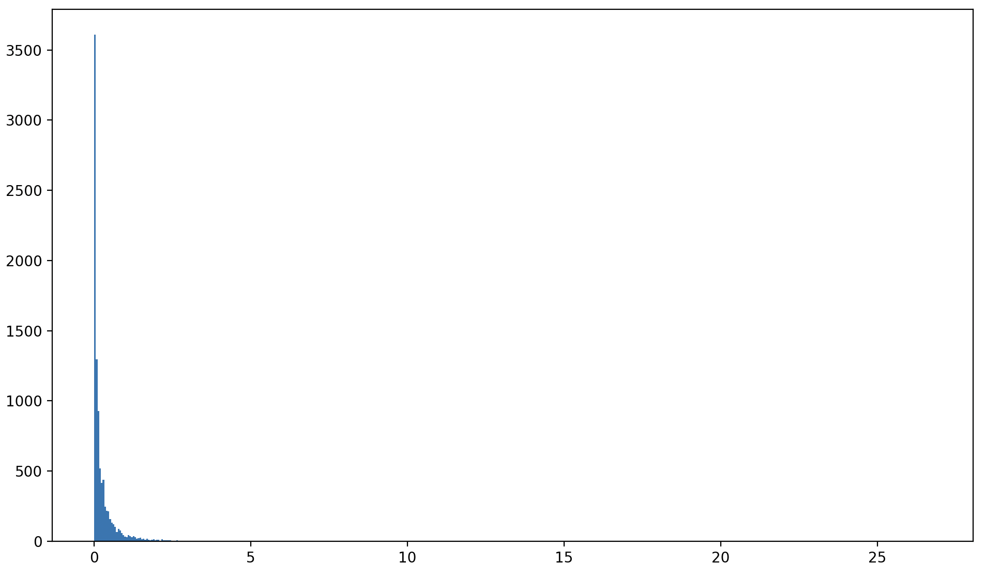
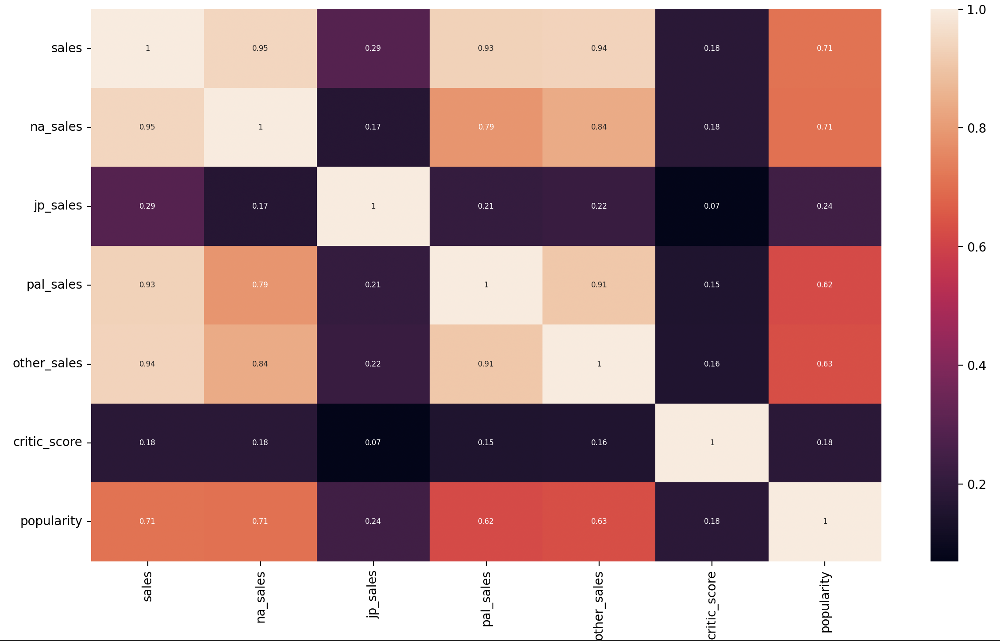

# Clasificador de videojuegos
Este modelo consiste en poder predecir la popularidad de los videojuegos a partir de ventas, calificaciones y datos de usuarios. 

## 1. Planteamiento de variables
Como se vió en el análisis de spotify, hay veces en las que no vale la pena siquiera normalizar algunas variables. Sin embargo, para este análisis hay algunas variables que, por la naturaleza del problema, no se pueden considerar. Dado que se informó el 5 de enero por medio del grupo del propedéutico general que el problema debe de ignorar plataformas, esta (`console`) será una variable que no será considerada. 

Para cada categoría de ventas (`total_sales`,`na_sales`,`jp_sales`,`pal_sales`,` other_sales`) se sumarán la totalidad de las ventas para el resultado de cada videojuego distinto. 

Para las críticas (`critic_score`) se promediarán entre cada título diferente. Las variables `release_date`,`last_update`,`publisher`,`genre` no serán consideradas pues el ejercicio solo nos pide considerar las publicaciones. 

## 2. Limpieza de datos

### Elementos duplicados
Para los elementos duplicados nos enfocaremos en comparar el nombre del videojuego y el desarrollador. En caso de haber al menos más de un elemento donde esto se repita se analizará más a fondo para identificar elementos que hayan sido introducidos 2 veces.

```python
import pandas as pd

videogameSet = pd.read_csv('vgchartz-2024.csv')
videogameSet.set_index('img', inplace=True)
names = videogameSet['title'].tolist()
publishers = videogameSet['publisher'].tolist()
platform = videogameSet['console'].tolist()
releaseDates = videogameSet['release_date'].tolist()
latestUpdate = videogameSet['last_update'].tolist()
totalSales = videogameSet['total_sales'].tolist()
naSales = videogameSet['na_sales'].tolist()
jpSales = videogameSet['jp_sales'].tolist()
palSales = videogameSet['pal_sales'].tolist()


namePublisherPair = []  
duped = 0
for i in range(len(names)):
    namePublisherPair.append([names[i],publishers[i],platform[i],releaseDates[i],latestUpdate[i],totalSales[i],naSales[i],jpSales[i],palSales[i]])

for i in range(len(namePublisherPair)):
    if namePublisherPair.count(namePublisherPair[i]) > 1:
        print(videogameSet.iloc[i])
        print(namePublisherPair[i])
        duped+=1

print('number of duplicates: ',duped)
>>> number of duplicates:  0

```

Ahora que sabemos que no hay entradas que sean exactamente iguales, podemos comenzar a crear el nuevo dataframe.

### Ajustando variables
Podemos comensar dimensionando el problema. Para esto contaremos cuantos videojuegos distintos hay. 
```python names = videogameSet['title'].tolist()
names = videogameSet['title'].tolist()
singleNames = []

for i in names:
    i = i.replace(' ','')   

for i in names:
    if i not in singleNames:
        singleNames.append(i)

print(len(singleNames))
>>> 39798

```
Ahora sabemos que hay aproximadamente 40 mil elementos diferentes. Esto nos puede ser útil para dimensionar el tamaño del problema. Ahora podemos ir ajustando las variables a considerar.

### Buscando valores nulos 

Antes de comenzar a sumar o promediar nuestras variables, debemos de analizar si tiene un tipo de datos uniforme.

```python

import pandas as pd
import math

videogameSet = pd.read_csv('vgchartz-2024.csv')
videogameSet.set_index('img', inplace=True)

def nanChecker(field):
    fieldList  = videogameSet[field]
    fieldList = fieldList.tolist()
    nanVal = float('nan')
    dTypes = []

    for i in fieldList:
        if type(i) not in dTypes and i != nanVal:
            dTypes.append(type(i))
        elif i == nanVal and 'nan' not in dTypes:
            dTypes.append('nan')
    print('Datatypes for ',field,':',dTypes)

nanChecker('total_sales')
nanChecker('na_sales')
nanChecker('jp_sales')
nanChecker('pal_sales')
nanChecker('other_sales')
nanChecker('critic_score')
>>> Datatypes for  total_sales : [<class 'float'>]
Datatypes for  na_sales : [<class 'float'>]
Datatypes for  jp_sales : [<class 'float'>]
Datatypes for  pal_sales : [<class 'float'>]
Datatypes for  other_sales : [<class 'float'>]
Datatypes for  critic_score : [<class 'float'>]
```
Ahora sabemos que para los datos que vamos a usar hay al menos un valor y no habrá problemas al sumarlos o multiplicarlos para calcular el promedio

### Sumando y multiplicando
Para esto usaremos la función que se muestra a continuación. A cada campo que queremos crear se crea una lista con los elementos de dicho campo. Posteriormente se revisa si en la lista de nombres hay solo un elemento. De ser así solo se asigna a la nueva lista el valor del campo actual. De no ser el caso hay 2 posibilidades, que sea una operación de suma (para variables de ventas) o que sea una operación de promedios. En caso de ser una operación de promedios se usa la siguiente fórmula la cual nos devuelve el promedio de un conjunto cuando le añadimos un elemento:
$$\overline{x_{n}} = \overline{x_{n-1}}+\frac{1}{N}(x_* -\overline{x_{n-1}}) $$
Para esto Xn es el conjunto nuevo, siendo X(n-  1) el conjunto antes de añadir el nuevo elemento y x* el elemento que deseamos añadir. 

```python
#creating arrays of lenght of not repeating names
newSales = [0]*len(newNames)
meanCount = [1]*len(newNames)
newNaSales = [0]*len(newNames)
newJpSales = [0]*len(newNames)
newPalSales = [0]*len(newNames)
newOtherSales = [0]*len(newNames)
newCriticScore = [0]*len(newNames)


def replacer(newList,field,operation):
    fieldList  = videogameSet[field].tolist()
    for i in range(len(names)):
        if names.count(names[i])==1:
            newList[newNames.index(names[i])] = fieldList[i]
        else:
            if operation =='sum':
                newList[newNames.index(names[i])] += fieldList[i]
            elif operation == 'mean':
                meanCount[newNames.index(names[i])] +=1
                newList[newNames.index(names[i])] = newList[newNames.index(names[i])] + (1/meanCount[newNames.index(names[i])])*(fieldList[i] - newList[newNames.index(names[i])])

replacer(newSales,'total_sales','sum')
replacer(newNaSales,'na_sales','sum')
replacer(newJpSales,'jp_sales','sum')
replacer(newPalSales,'pal_sales','sum')
replacer(newOtherSales,'other_sales','sum')
replacer(newCriticScore,'critic_score','mean')

```
Notese que para no tener problemas de consultar índices fuera de rango se han predefinido las longitudes de cada lista usada, Además de que la lista  de `meanCount`ha tenido que ser inicializada con 1s para no encontrarnos el problema de que se divida entre 0.

## 3. Armando el modelo
### Definiendo popularidades
Antes de siquiera poder armar el modelo, debemos de asignar un criteiro para que se considera muy popular, moderadamente popular y poco popular. Por lo tanto he decidido graficar los datos para poder visualizarlos mejor. 

```python
#Histogram of total sales
plt.hist(newSales,bins=500)
plt.show()
```




Como se puede visualizar, la mayoría de los datos tiene muy pocas ventas o casi ninguna venta, por lo tanto es mejor imprimir los percentiles de los valores encontrados en los datos. 

```python
from scipy import stats as stats
for i in range(0,100,5):
    print(stats.scoreatpercentile(newSales,i))
>>>
0.0
0.0
0.0
0.0
0.0
0.0
0.0
0.0
0.0
0.0
0.0
0.0
0.0
0.0
0.01
0.03
0.07
0.15
0.3
0.73

```
Debemos de analizar percentiles más altos para más correctamente hacer las inferencias de que cuenta como un juego bastante popular o moderadamente popular

```python
for i in range(75,100,2):
    print(stats.scoreatpercentile(newSales,i))
>>>0.03
0.04
0.06
0.08
0.11
0.15
0.2
0.27
0.35
0.49
0.73
1.23
3.0237999999999734

```
Haremos un último análisis para revisar cuando comienzan los valores de 2 dígitos

```python
j=99.5
for i in range(10):
    print(stats.scoreatpercentile(newSales,j))
    j= j+0.2
>>>1.75
5.1519000000000235
5.431419999999925
5.739519999999976
6.278329999999987
6.6985599999997065
7.26
7.634759999999877
8.800689999999376
12.293779999996987
16.21260999999838

```
Si bien la no se pudo encontrar, sabemos que está aproximadamente en el último 99.98% de los datos. Para evaluar la popularidad de los videojuegos se ha escogido por evaluar los videojuegos con ventas totales menores a 1 como poco populares y los que sean mayor a 10 como demasiado populares. Para ser esto fácil de correlacionar cada categoría tendrá su número asignado.

|Menos populares|Moderadamente populares| Muy populares|
|---|---|---|
|0|1|2|

```python
popularity = [0]*len(newSales)
for i in range(len(newSales)):
    if newSales[i] >= 10:
        popularity[i] = 2
    elif newSales[i] >= 1:
        popularity[i] = 1
    else:
        popularity[i] = 0


```


### Seleccionando variables
Ahora que tenemos todas las variables, podeoms evaluar la correlación entre las variables. Para reducir el tiempo de ejecución se eligió crear un nuevo csv para trabajar a partir de ahí

```python 
newdFData = pd.DataFrame({'name':newNames,'sales':newSales,'na_sales':newNaSales,'jp_sales':newJpSales,'pal_sales':newPalSales,'other_sales':newOtherSales,'critic_score':newCriticScore,'popularity':popularity})
newdFData.set_index('name',inplace=True)
newdFData.to_csv('newvgamedata.csv',index=False)

```

Podemos comenzar mostrando el mapa de calor correspondiente a la matriz de correlación

```python
import seaborn as sb
newvGameCSV = pd.read_csv('newvgamedata.csv')
heatmap = sb.heatmap(newvGameCSV.corr(method = 'pearson'), annot=True, annot_kws={'size': 6},xticklabels=True, yticklabels=True)
plt.show()
```


Como podemos ver, las variables con coeficiente de pearson mayor a 0.3 son `pal_sales`,`other_sales`, `sales`y `na_sales`. Estas serán las que serán tomadas en cuenta pues [coeficientes menores no vale la pena analizarlos](#keith-g-calkins-2005-julio-18applied-statistics---lesson-5--correlation-coefficients-andrews--universityhttpswwwandrewseducalkinsmathedrm611edrm05htmtextcorrelation-coefficients-whose-magnitude-are-between-03-and-05-indicateif-any-linear-correlation)

Eliminaremos las variables restantes para comenzar a construir el modelo

```python
newvGameCSV.drop('critic_score', axis=1, inplace=True)
newvGameCSV.drop('jp_sales', axis=1, inplace=True)
```

### Normalizando variables
Para normalizar variables usaremos la siguiente función la cual divide todos los datos entre el máximo de datos para que sean de 0 a 1

```python
def normalizer(field):
    normalizedList = newvGameCSV[field].tolist()
    maxVal = max(normalizedList)    
    for i in range(len(normalizedList)):
        normalizedList[i] = normalizedList[i]/maxVal
    newvGameCSV[field] = normalizedList

normalizer('sales')
normalizer('na_sales')
normalizer('pal_sales')
normalizer('other_sales')

```
## 4. Entrenando el modelo
### Creando sets de entrenamiento y prueba
Para entrenar nuestro modelo, debemos comenzar por separar nuestros datos end atos de entrenamiento y en datos de prueba.
```python
from sklearn.model_selection import train_test_split
from sklearn.metrics import mean_squared_error
from sklearn.ensemble import RandomForestRegressor
X = newvGameCSV.drop('popularity',axis=1)
y = newvGameCSV['popularity']
X_train,X_test,y_train,y_test = train_test_split(X,y,test_size=0.3)

```
Se importaron algunas librerías que serán usadas en las siguientes partes del desarrollo.

### Entrenando y evaluando el modelo
Finalmente podemos entrenar el modelo. Se usó la métrica de `Root Mean Square Error`la cual mide la distancia media entre las predicciones y el valor real. Dicha métrica usa la siguiente fórmula:
$$RMSE = \sqrt{\frac{1}{n}\sum_{i=1}^n (y_i-\hat{y}_i)}$$
```python
treeModel  = RandomForestRegressor()
treeModel.fit(X_train,y_train)
print('Mean square error: ', root_mean_squared_error(y_test,treeModel.predict(X_test)))
>>>Mean square error:  0.003268004867432665
```


## Referencias

###### Keith G. Calkins (2005, Julio 18)Applied Statistics - Lesson 5  Correlation Coefficients. Andrews  University.https://www.andrews.edu/~calkins/math/edrm611/edrm05.htm#:~:text=Correlation%20coefficients%20whose%20magnitude%20are%20between%200.3%20and%200.5%20indicate,if%20any%20(linear)%20correlation.